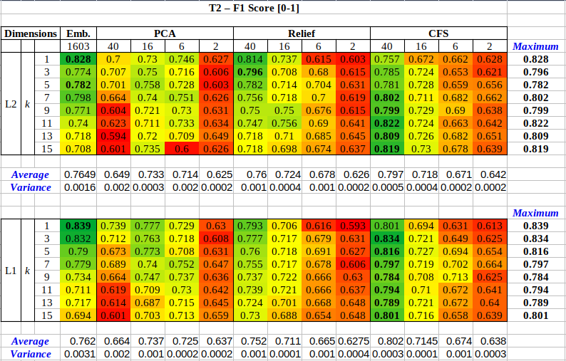

# Supplementary Material

**If you use data and/or images from this repository in your research, please include the proper citation to the paper below.**

**A conference paper entitled "Wia-Spine: A CBIR environment with embedded radiomic features to assess fragility fractures" was submitted to the IEEE 35th International Symposium on Computer-Based Medical Systems (CBMS). The supplementary list of materials for the paper is as follows.**

## The HC_LVERT dataset

The complete image dataset is available [here](https://github.com/marcosivni/WiaSpine/blob/main/CBMS_Supplementary_Files/Images/Imgs.zip).
Please, notice that:

1. The images are available in the JPEG_Images folder.
> Only sagittal anonymized images were included in the folder. To complete MRI DICOM studies, please contact the authors by email to issue a formal request to access personal data.

2. The overlays are available in the Overlay_Images folder.
> You can use the binary mask to overlay the images within the folder JPEG_Images.

The dataset annotations are available [here](https://github.com/marcosivni/WiaSpine/tree/main/CBMS_Supplementary_Files/Data/HC_LVERT.csv). 
They include three files, namely:

1. [HC_LVERT_Attribute_Caption.csv](https://github.com/marcosivni/WiaSpine/blob/main/CBMS_Supplementary_Files/Data/HC_LVERT_Attribute_Caption.csv) - It includes the description and interpretation of metadata attributes.

2. [HC_LVERT.csv](https://github.com/marcosivni/WiaSpine/blob/main/CBMS_Supplementary_Files/Data/HC_LVERT.csv) - It contains the diagnosis and references for the dataset patients.
> Patient annotations are rather global information that will be eventually replicated for different vertebral bodies.

3. [HC_LVERT_ALL_VERTEBRAE.csv](https://github.com/marcosivni/WiaSpine/blob/main/CBMS_Supplementary_Files/Data/HC_LVERT_ALL_VERTEBRAE.csv) - It includes the diagnosis and references for the dataset vertebral bodies.

The fine-tuned radiomic features employed in the experiments are available in the files:

1. [Features.csv](https://github.com/marcosivni/WiaSpine/blob/main/CBMS_Supplementary_Files/Data/Features.csv) - Data can be used for other Machine Learning tasks and/or scholar/teaching activities.
> Features can be row-crossed against file HC_LVERT_ALL_VERTEBRAE.csv to generate a dataset with features and annotations combined.

2. [Names_FS_Relief.csv](https://github.com/marcosivni/WiaSpine/blob/main/CBMS_Supplementary_Files/Data/Names_FS_Relief.csv) - Names of the PyRadiomic select features (top-40) by Relief.

Radiomic features analyzed in the experiments are available in the files:

1. [Patients_HC_LVERT.arff](https://github.com/marcosivni/WiaSpine/blob/main/CBMS_Supplementary_Files/Data/Patients_HC_LVERT.arff) - Annotated data grouped by patient.

2. [DatasetMinusIds.arff](https://github.com/marcosivni/WiaSpine/blob/main/CBMS_Supplementary_Files/Data/DatasetMinusIds.arff) - Scaled radiomic features, embedding dimensionality.

3. [Dataset_T2_40d_REL_BIN.arff](https://github.com/marcosivni/WiaSpine/blob/main/CBMS_Supplementary_Files/Data/Dataset_T2_40d_REL_BIN.arff) - Scaled radiomic features, RelieF selection (SP rule).

4. [Dataset_T2_40d_PCA_BIN.arff](https://github.com/marcosivni/WiaSpine/blob/main/CBMS_Supplementary_Files/Data/Dataset_T2_40d_PCA_BIN.arff) - Scaled radiomic features, PCA transformation (SP rule).

5. [Dataset_T2_40d_CFS_BIN.arff](https://github.com/marcosivni/WiaSpine/blob/main/CBMS_Supplementary_Files/Data/Dataset_T2_40d_CFS_BIN.arff) - Scaled radiomic features, CFS selection (SP rule).

6. [Dataset_T2_16d_REL_BIN.arff](https://github.com/marcosivni/WiaSpine/blob/main/CBMS_Supplementary_Files/Data/Dataset_T2_16d_REL_BIN.arff) - Scaled radiomic features, RelieF selection (BS rule).

7. [Dataset_T2_16d_PCA_BIN.arff](https://github.com/marcosivni/WiaSpine/blob/main/CBMS_Supplementary_Files/Data/Dataset_T2_16d_PCA_BIN.arff) - Scaled radiomic features, PCA transformation (BS rule).

8. [Dataset_T2_16d_CFS_BIN.arff](https://github.com/marcosivni/WiaSpine/blob/main/CBMS_Supplementary_Files/Data/Dataset_T2_16d_CFS_BIN.arff) - Scaled radiomic features, CFS selection (BS rule).

9. [Dataset_T2_6d_REL_BIN.arff](https://github.com/marcosivni/WiaSpine/blob/main/CBMS_Supplementary_Files/Data/Dataset_T2_6d_REL_BIN.arff) - Scaled radiomic features, RelieF selection (KG rule).

10. [Dataset_T2_6d_PCA_BIN.arff](https://github.com/marcosivni/WiaSpine/blob/main/CBMS_Supplementary_Files/Data/Dataset_T2_6d_PCA_BIN.arff) - Scaled radiomic features, PCA transformation (KG rule).

11. [Dataset_T2_6d_CFS_BIN.arff](https://github.com/marcosivni/WiaSpine/blob/main/CBMS_Supplementary_Files/Data/Dataset_T2_6d_CFS_BIN.arff) - Scaled radiomic features, CFS selection (KG rule).

12. [Dataset_T2_2d_REL_BIN.arff](https://github.com/marcosivni/WiaSpine/blob/main/CBMS_Supplementary_Files/Data/Dataset_T2_2d_REL_BIN.arff) - Scaled radiomic features, RelieF selection (ID rule).

13. [Dataset_T2_2d_PCA_BIN.arff](https://github.com/marcosivni/WiaSpine/blob/main/CBMS_Supplementary_Files/Data/Dataset_T2_2d_PCA_BIN.arff) - Scaled radiomic features, PCA transformation (ID rule).

14. [Dataset_T2_2d_CFS_BIN.arff](https://github.com/marcosivni/WiaSpine/blob/main/CBMS_Supplementary_Files/Data/Dataset_T2_2d_CFS_BIN.arff) - Scaled radiomic features, CFS selection (ID rule).

The learning models discussed in the experiments are available in the files:

1. [kNN-Base-K1-L2.model](https://github.com/marcosivni/WiaSpine/blob/main/CBMS_Supplementary_Files/Test_Code/kNN-Base-K1-L2.model) - kNN-based model.

2. [JRIP-Patients-HC_LVERT.model](https://github.com/marcosivni/WiaSpine/blob/main/CBMS_Supplementary_Files/Test_Code/JRIP-Patients-HC_LVERT.model) - JRip-based model.

3. [J48-DT-Patients-HC_LVERT.model](https://github.com/marcosivni/WiaSpine/blob/main/CBMS_Supplementary_Files/Test_Code/J48-DT-Patients-HC_LVERT.model) - J48-based model.

The matlab script to reproduce the t-Test is available in the file:

1. [testskNN.m](https://github.com/marcosivni/WiaSpine/blob/main/CBMS_Supplementary_Files/Test_Code/testskNN.m) - Matlab script to reproduce the hypothesis test.

## Experimental Workbench

**Data Analysis (Page 04).**

1. Setup:
    - Weka Version: 3.8.4 (Available [here](https://waikato.github.io/weka-wiki/)).
    - Input file: [Patients_HC_LVERT.arff](https://github.com/marcosivni/WiaSpine/blob/main/CBMS_Supplementary_Files/Data/Patients_HC_LVERT.arff)
    - Input model (Decision-Tree): [J48-DT-Patients-HC_LVERT.model](https://github.com/marcosivni/WiaSpine/blob/main/CBMS_Supplementary_Files/Test_Code/J48-DT-Patients-HC_LVERT.model)
    - (Batch size: 20, Binary splits, Unpruned, Min objects per leaf: 02)
    - Input model (Decision-Rules): JRIP-Patients-HC_LVERT.model
    - (Batch size: 20)

2. Outputs – 05-folds cross-validation:
    - Decision-Tree – Log [here](Results/Cross-Validated-DT-Patients_HC_LVERT.txt).

3. Outputs – 05-folds cross-validation:
    - Decision-Rules – Log [here](Results/Cross-Validated-DR-Patients_HC_LVERT.txt).
    
    
**Wia-Spine fine-tuning (Page 04).**

1.  Setup:
    - Weka Version: 3.8.4 (Available [here](https://waikato.github.io/weka-wiki/)).
    - Input files [DatasetMinusIds.arff](Data/DatasetMinusIds.arff)
    - Input files [Dataset_T2_40d_REL_BIN.arff](Data/Dataset_T2_40d_REL_BIN.arff)
    - Input files [Dataset_T2_40d_PCA_BIN.arff](Data/Dataset_T2_40d_PCA_BIN.arff)
    - Input files [Dataset_T2_40d_CFS_BIN.arff](Data/Dataset_T2_40d_CFS_BIN.arff)
    - Input files [Dataset_T2_16d_REL_BIN.arff](Data/Dataset_T2_16d_REL_BIN.arff)
    - Input files [Dataset_T2_16d_PCA_BIN.arff](Data/Dataset_T2_16d_PCA_BIN.arff)
    - Input files [Dataset_T2_16d_CFS_BIN.arff](Data/Dataset_T2_16d_CFS_BIN.arff)
    - Input files [Dataset_T2_6d_REL_BIN.arff](Data/Dataset_T2_6d_REL_BIN.arff)
    - Input files [Dataset_T2_6d_PCA_BIN.arff](Data/Dataset_T2_6d_PCA_BIN.arff)
    - Input files [Dataset_T2_6d_CFS_BIN.arff](Data/Dataset_T2_6d_CFS_BIN.arff)
    - Input files [Dataset_T2_2d_REL_BIN.arff](Data/Dataset_T2_2d_REL_BIN.arff)
    - Input files [Dataset_T2_2d_PCA_BIN.arff](Data/Dataset_T2_2d_PCA_BIN.arff)
    - Input files [Dataset_T2_2d_CFS_BIN.arff](Data/Dataset_T2_2d_CFS_BIN.arff)
    - Input model (kNN): [kNN-Base-K1-L2.model](Test_Code/kNN-Base-K1-L2.model)
    - (k: {1,3,5,7,9,11,13,15}, distance function: {ManhattanDistance, EuclideanDistance})

2. Outputs – 10-folds cross-validation:

**Wia-Spine fine-tuning (Page 05) – Hypothesis Test.**

1.  Setup:
    - MatLab implementation
    - Input file [DatasetMinusIds.arff](Data/DatasetMinusIds.arff)
    - Input file [Dataset_T2_40d_REL_BIN.arff](Data/Dataset_T2_40d_REL_BIN.arff)
    - Input file [Dataset_T2_40d_PCA_BIN.arff](Data/Dataset_T2_40d_PCA_BIN.arff)
    - Input file [Dataset_T2_40d_CFS_BIN.arff](Data/Dataset_T2_40d_CFS_BIN.arff)
    - Script: [testskNN.m](Test_Code/testskNN.m)
    
2. Outputs – 10x10 Error matrices:
    - Available [here](Results/ErrorMatrices.txt).
    

    Identification of fragility fractures with Wia-Spine (Page 05).

1.  Setup:
    - CBIR [Wia-Spine](https://github.com/marcosivni/WiaSpine).
    - Weka Version: 3.8.4 (Available [here](https://waikato.github.io/weka-wiki/)).
    - Input files [Dataset_T2_40d_REL_BIN.arff](Data/Dataset_T2_40d_REL_BIN.arff)
    - Input model (kNN): [kNN-Base-K1-L2.model](Test_Code/kNN-Base-K1-L2.model)
    - (k: 1, distance function: EuclideanDistance)
    - Leave-One-Out (273)

2. Outputs – Leave-One-Out:
    - Fracture detection – Log [here](Results/LeaveOneOutTunedCBIR.txt).
    

**Predicting fragility fractures with Wia-Spine (Page 05).**

1. Setup:
    - CBIR [Wia-Spine](https://github.com/marcosivni/WiaSpine).

2. Case Studies
    - Patient 01 
        - MRI first study [here (2012-Sep-30)](http://dicomlibrary.com?study=1.3.6.1.4.1.44316.6.102.1.2022030510732133.323727696100779931513).
        - MRI second study [here (2019-Aug-17)](http://dicomlibrary.com?study=1.3.6.1.4.1.44316.6.102.1.2022030414417364.481845788140780986600).
        
    - Patient 02
        - MRI first study [here (2017-Fev-16)](http://dicomlibrary.com?study=1.3.6.1.4.1.44316.6.102.1.20220304145716215.38374917099517736999).
        - MRI second study [here (2021-Mar-04)](http://dicomlibrary.com?study=1.3.6.1.4.1.44316.6.102.1.2022030415029515.418831532988894715682).
        
    - Patient 03
        - MRI first study [here (2017-Jul-07)](http://dicomlibrary.com?study=1.3.6.1.4.1.44316.6.102.1.20220304151932205.12250805085753514894).
        - MRI second study [here (2018-Jul-28)](http://dicomlibrary.com?study=1.3.6.1.4.1.44316.6.102.1.20220304151933481.20656500089457984122).
        

## Notes

_(C) THIS SOFTWARE IS PROVIDED ``AS IS'' AND ANY EXPRESSED OR IMPLIED WARRANTIES, INCLUDING, BUT NOT LIMITED TO, THE IMPLIED WARRANTIES OF MERCHANTABILITY AND FITNESS FOR A PARTICULAR PURPOSE ARE DISCLAIMED.  IN NO EVENT SHALL THE AUTHORS OF THIS SOFTWARE OR ITS CONTRIBUTORS BE LIABLE FOR ANY DIRECT, INDIRECT, INCIDENTAL, SPECIAL, EXEMPLARY, OR CONSEQUENTIAL DAMAGES (INCLUDING, BUT NOT LIMITED TO, PROCUREMENT OF SUBSTITUTE GOODS OR SERVICES; LOSS OF USE, DATA, OR PROFITS; OR BUSINESS INTERRUPTION) HOWEVER CAUSED AND ON ANY THEORY OF LIABILITY, WHETHER IN CONTRACT, STRICT LIABILITY, OR TORT (INCLUDING NEGLIGENCE OR OTHERWISE) ARISING IN ANY WAY OUT OF THE USE OF THIS SOFTWARE, EVEN IF ADVISED OF THE POSSIBILITY OF SUCH DAMAGE._

[//]: # (These are reference links used in the body of this note and get stripped out when the markdown processor does its job. There is no need to format it nicely because it shouldn't be seen. Thanks SO - http://stackoverflow.com/questions/4823468/store-comments-in-markdown-syntax)
